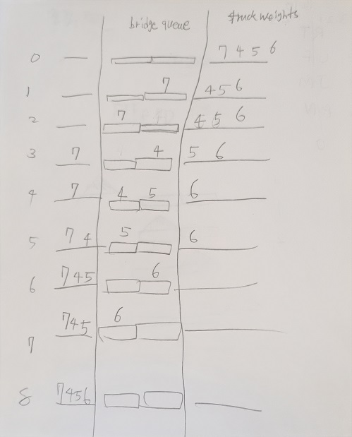

# 다리를 지나는 트럭
* 범주: 스택/큐
* 레벨: 2
* 날짜: 2022-09-03
* 소요시간: 150 분
* 링크: https://school.programmers.co.kr/learn/courses/30/lessons/42583

# 설명
시뮬레이션 프로그래밍 문제다. 문제를 이해하는 것이 중요하지만, 사실 이 문제의 설명이 불친절해서 이해하기가 어려웠다.
나라면 아래의 조건을 덧붙였을 것이다.

* 트럭이 이동하는 도중의 상황은 고려하지 않는다. 즉, 1초를 최소 단위로 생각하는 것이다. (예: 타임스탬프가 **0.5초** 또는 **1.7초** 등의 소수의 경우들을 생각하지 않는다)
* 다리에는 최대 `bridge_length` 대 만큼의 차량이 올라갈 수 있다고 한다. 그리고 변수 이름을 보면 다리의 길이라는 것을 유추할 수 있다. 반면의 트럭의 길이는 주어지지 않았다. 트럭은 길이가 `0`인 **점(Point)** 으로 보는 게 편하다.
* 테스트케이스 예시도 알아보기 쉽게 나타내면 아래와 같다. 다리를 건너는 트럭 column 에서 x는 다리의 빈 자리다. 물론 다리는 queue로 구현해야 하지만 Array 관점으로 보면 저렇다. 길이가 2로 고정된 특별한 queue라고 보면 되겠다.

    | 경과 시간 | 다리를 지난 트럭 | 다리를 건너는 트럭 | 대기 트럭 |
    |-----------|------------------|--------------------|-----------|
    | 0         | []               | [x,x]              | [7,4,5,6] |
    | 1         | []               | **[x,7]**          | [4,5,6]   |
    | 2         | []               | **[7,x]**          | [4,5,6]   |
    | 3         | [7]              | [x,4]              | [5,6]     |
    | 4         | [7]              | [4,5]              | [6]       |
    | 5         | [7,4]            | [5,x]              | [6]       |
    | 6         | [7,4,5]          | **[x,6]**          | []        |
    | 7         | [7,4,5]          | **[6,x]**          | []        |
    | 8         | [7,4,5,6]        | [x,x]              | []        |

결론부터 말하자면, 쉬운 문제를 어렵게 접근했다. 내 최종 풀이법은 큐에 들어가는 트럭 정보 `TruckInfo` 에 대해 가중치 `Weight`와 예상 도착 시각 `ArrivedAt`을 부여한다. 그리고 매 tick마다 트럭의 이동을 통제한다. 이전에는 예상 도착 시간을 global하게 하나의 변수만 사용하려고 했지만 결국 실패했고 시간도 많이 지체됐다.

STL의 pair를 쓰려다가, first와 second를 구별하는 게 힘들어서 대신 구조체를 만들었다. 멤버이름을 명확히 하면 코드를 읽는 사람도 불편함이 없다.

이런 문제는 테스트케이스를 가져다가 공책에 직접 그림을 그리고 이해하는 게 베스트다. 항상 머리로는 해야지 하는데 있는데, 실천이 어렵다. 귀찮더라도 그림을 그려보자 주빈아.



위 테스트케이스에서 2초에서 3초로 넘어갔을 때를 유심히 봐야 한다. 2초에서 중량 7 트럭이 다리를 건넜으면 끝나는 게 아니라, 그 뒤를 따라오는 중량 4 트럭도 다리에 올리도록 같은 시간에 처리해야 한다. 다리에 있는 트럭을 처리 후, 트럭을 하나 올리도록 코드를 짜야 한다. 이 알고리듬의 순서가 바뀌면 안 된다.

## 틀린 순서
```cpp
// 트럭을 다리에 올릴 수 있다면
if (static_cast<int>(q.size()) < bridgeLength && sumWeight + truckWeights[i] <= weightCapacity)
{
    q.push(TruckInfo(truckWeights[i], time + bridgeLength));
    sumWeight += truckWeights[i++];
}
// 다리를 다 지난 트럭이라면
if (!q.empty() && q.front().ArrivedAt == time)
{
    sumWeight -= q.front().Weight;
    q.pop();
}
```
## 올바른 순서
```cpp
// 다리를 다 지난 트럭이라면
if (!q.empty() && q.front().ArrivedAt == time)
{
    sumWeight -= q.front().Weight;
    q.pop();
}
// 트럭을 다리에 올릴 수 있다면
if (static_cast<int>(q.size()) < bridgeLength && sumWeight + truckWeights[i] <= weightCapacity)
{
    q.push(TruckInfo(truckWeights[i], time + bridgeLength));
    sumWeight += truckWeights[i++];
}
```

# 소스코드

| **Before**    | **After**      |
|---------------|----------------|
| bridge_length | bridgeLength   |
| weight        | weightCapacity |
| truck_weights | truckWeights   |

camelCase 사용을 위해 변수명을 변경하였다.

```cpp
#include <string>
#include <vector>
#include <queue>
#include <cassert>

using namespace std;

typedef struct TruckInfo
{
    const int Weight;
    const int ArrivedAt;

    TruckInfo(const int weight, const int arrivedAt)
        : Weight(weight)
        , ArrivedAt(arrivedAt)
    {
    }
};

int solution(const int bridgeLength, const int weightCapacity, vector<int> truckWeights);

int solution(const int bridgeLength, const int weightCapacity, vector<int> truckWeights)
{
    int time = 0;
    int sumWeight = 0;
    int i = 0;
    queue<TruckInfo> q;
    
    while (i < static_cast<int>(truckWeights.size()))
    {
        // 다리를 다 지난 트럭이라면
        if (!q.empty() && q.front().ArrivedAt == time)
        {
            sumWeight -= q.front().Weight;
            q.pop();
        }
        // 트럭을 다리에 올릴 수 있다면
        if (static_cast<int>(q.size()) < bridgeLength && sumWeight + truckWeights[i] <= weightCapacity)
        {
            q.push(TruckInfo(truckWeights[i], time + bridgeLength));
            sumWeight += truckWeights[i++];
        }

        ++time;
    }

    // 더 이상 출발할 트럭이 없다면 (i >= truckWeights.size() 인 경우)
    // 다리 위에 있는 트럭들을 처리한다.
    while (!q.empty())
    {
        if (q.front().ArrivedAt == time)
        {
            q.pop();
        }
        ++time;
    }

    return time;
}

int main()
{
    int answer = solution(2, 10, { 7, 4, 5, 6 });
    assert(answer == 8);

    answer = solution(100, 100, { 10 });
    assert(answer == 101);

    answer = solution(100, 100, { 10, 10, 10, 10, 10, 10, 10, 10, 10, 10 });
    assert(answer == 110);

    return 0;
}
```

# 결과
```
채점을 시작합니다.
정확성  테스트
테스트 1 〉	통과 (0.01ms, 3.63MB)
테스트 2 〉	통과 (0.07ms, 4.18MB)
테스트 3 〉	통과 (0.01ms, 4.09MB)
테스트 4 〉	통과 (0.06ms, 4.17MB)
테스트 5 〉	통과 (0.60ms, 3.66MB)
테스트 6 〉	통과 (0.16ms, 4.18MB)
테스트 7 〉	통과 (0.01ms, 4.09MB)
테스트 8 〉	통과 (0.01ms, 4.1MB)
테스트 9 〉	통과 (0.04ms, 4.17MB)
테스트 10 〉	통과 (0.01ms, 4.16MB)
테스트 11 〉	통과 (0.01ms, 4.17MB)
테스트 12 〉	통과 (0.01ms, 4.18MB)
테스트 13 〉	통과 (0.01ms, 4.17MB)
테스트 14 〉	통과 (0.01ms, 4.17MB)
채점 결과
정확성: 100.0
합계: 100.0 / 100.0
```